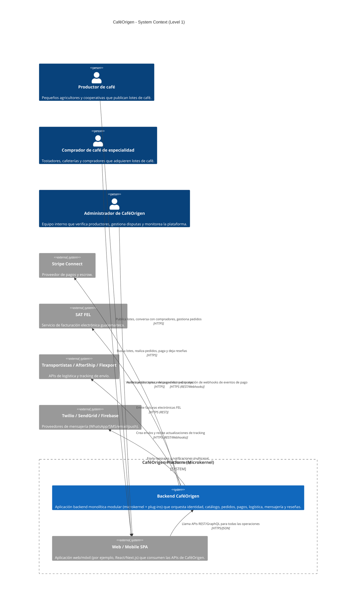

# 01 — System Context (C4 Level 1)

Este diagrama muestra a **CaféOrigen** como un solo sistema de backend (arquitectura **microkernel** con plug‑ins), los actores humanos y los sistemas externos con los que interactúa. No se muestran componentes internos ni bounded contexts; el foco es el “big picture”.

## Diagrama de contexto del sistema

## Explicación

- **Un solo backend (CaféOrigenBackend)**  
  El backend se despliega como **un único proceso / contenedor** que implementa una arquitectura **microkernel**:  
  - El núcleo orquesta peticiones, autenticación, eventos internos y configuración.  
  - Los plug‑ins implementan los bounded contexts: Identidad, Catálogo, Pedidos, Pagos, Logística, Mensajería y Reseñas.

- **Actores humanos**  
  - **Productor**: crea su perfil, envía documentos para verificación y publica lotes.  
  - **Comprador**: explora el catálogo, realiza pedidos, paga vía escrow y deja reseñas.  
  - **Administrador**: verifica productores, revisa disputas de pedidos/pagos y monitorea la operación.

- **Sistemas externos**  
  - **Stripe Connect** para pagos escrow.  
  - **SAT FEL** para facturación fiscal obligatoria en Guatemala.  
  - **Transportistas / AfterShip / Flexport** para logística y tracking.  
  - **Twilio / SendGrid / Firebase** para mensajería y notificaciones.

Este nivel de contexto enfatiza que, aunque a futuro algunos plug‑ins podrían extraerse como microservicios, en la fase actual el sistema se opera como una **plataforma única** con integraciones bien encapsuladas hacia el exterior.