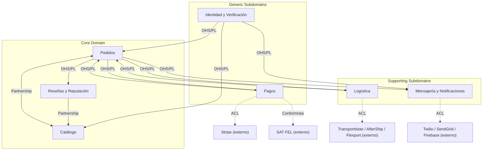

# 02 — Bounded Context Map (DDD)

Este diagrama resume los **7 contextos delimitados** definidos en `proposals/02-bounded-contexts.md`, agrupados por tipo de dominio (**Core / Supporting / Generic**) y etiquetando cada relación con su **patrón de integración**.

## Diagrama de mapa de contextos

## Leyenda

- **Tipos de dominio**
  - **Core Domain**:  
    - **Pedidos**: corazón del modelo de negocio (flujo de compra, estados de pedido, disputas).  
    - **Catálogo**: discovery y gestión de lotes de café de especialidad.  
    - **Reseñas y Reputación**: confianza y reputación, clave para el valor del marketplace.
  - **Supporting Subdomains**:  
    - **Logística**: envíos y tracking, crítico pero no único del negocio de CaféOrigen.  
    - **Mensajería**: chat y notificaciones que dan soporte al flujo principal.
  - **Generic Subdomains**:  
    - **Identidad**: autenticación, verificación de productores; dominio genérico pero con reglas propias del contexto.  
    - **Pagos**: lógica de pagos y facturación, basada fuertemente en servicios externos (Stripe, SAT FEL).

- **Patrones de integración**
  - **OHS/PL (Open Host Service / Published Language)**:  
    Un contexto expone una interfaz estable y un lenguaje publicado (DTOs, eventos) que otros contextos consumen.  
    Ejemplo: Identidad → Catálogo/Pedidos/Mensajería con `ResumenUsuarioDTO`, `EstadoProductorDTO`.
  - **Partnership**:  
    Dos contextos co‑evolucionan y requieren coordinación cercana.  
    Ejemplo: Catálogo ↔ Pedidos (disponibilidad de lotes y creación/cancelación de pedidos).  
    Ejemplo: Reseñas → Catálogo (reputación afecta ranking de lotes).
  - **ACL (Anti-Corruption Layer)**:  
    Capa de traducción que protege el modelo de dominio de las peculiaridades de APIs externas (Stripe, transportistas, canales de mensajería).
  - **Conformista**:  
    CaféOrigen debe ajustarse al modelo de un tercero sin negociación, como SAT FEL para la facturación fiscal.

## Explicación

Este mapa refuerza:

- La decisión de arquitectura **microkernel**: cada bounded context se implementa como un **módulo plug‑in** dentro de un solo backend, pero mantiene **fronteras claras de dominio**.
- La orientación **event-driven interna** descrita en `02-bounded-contexts.md` y `04-data-flow-and-interactions.md`:  
  - Pedidos actúa como **emisor central** de eventos de negocio (`PedidoRealizado`, `PedidoConfirmado`, etc.).  
  - Pagos, Logística, Mensajería y Reseñas reaccionan a esos eventos sin acoplarse directamente a las entidades de Pedidos.
- Los contextos **Generic** y **Supporting** son buenos candidatos a ser extraídos como servicios independientes en una fase futura, sin romper el lenguaje ubícuo ni los límites actuales.