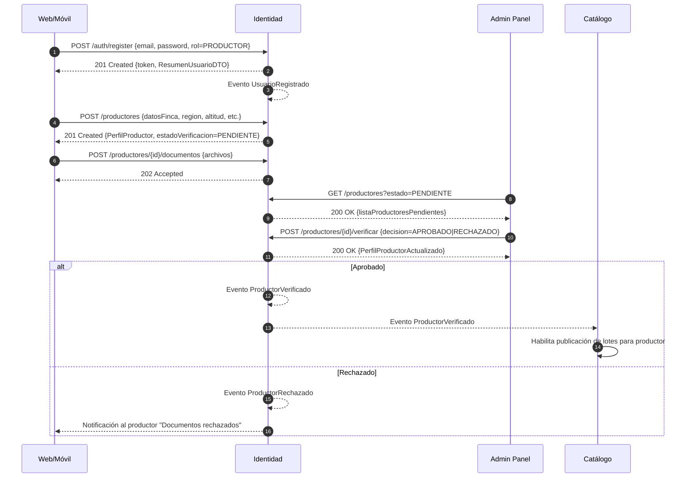
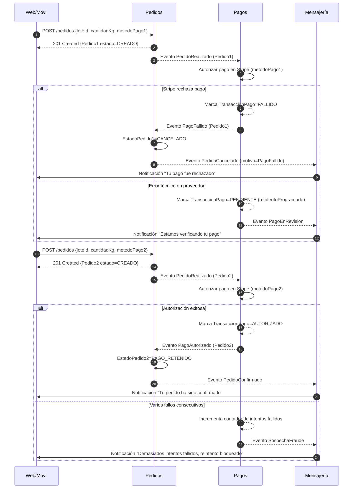

# 03 — Data Flow (Sequence Diagrams)

Este archivo contiene **tres** diagramas de secuencia que describen flujos clave del sistema, alineados con `proposals/04-data-flow-and-interactions.md`.  
Cada diagrama muestra tanto el **happy path** como al menos una **ruta de fallo / compensación**.

---

## 1. Flujo 1 — Registro de usuario y verificación de productor

### 1.1 Diagrama de secuencia



### 1.2 Explicación

- El **módulo Identidad** controla todo el flujo de registro y verificación, y publica eventos (`ProductorVerificado`, `ProductorRechazado`) que otros módulos consumen.
- **Catálogo** es downstream: solo permite crear/publicar lotes para productores con estado de verificación `APROBADO`.
- La rama de fallo (**RECHAZADO**) ilustra cómo se maneja la ruta de compensación: el productor es notificado y puede volver a subir documentos.

---

## 2. Flujo 2 — Pedido completo de un lote (orden de compra)

### 2.1 Diagrama de secuencia

```mermaid
sequenceDiagram
    autonumber
    participant Web as Web/Móvil
    participant Cat as Catálogo
    participant Ord as Pedidos
    participant Pay as Pagos
    participant Log as Logística
    participant Msg as Mensajería

    %% Búsqueda de lote
    Web->>Cat: GET /lotes?filtros…
    Cat-->>Web: 200 OK {lotesDisponibles}

    %% Creación de pedido
    Web->>Ord: POST /pedidos {loteId, cantidadKg, direccionEnvio}
    Ord->>Cat: Verificar disponibilidad y precio del lote
    Cat-->>Ord: OK {detalleLote}
    Ord-->>Web: 201 Created {Pedido estado=CREADO}
    Ord-->>Ord: Evento PedidoRealizado

    %% Autorización de pago en escrow
    Ord-->>Pay: Evento PedidoRealizado
    Pay->>Pay: Crea TransaccionPago + RetencionEscrow (Stripe)
    alt Pago autorizado
        Pay-->>Pay: Evento PagoAutorizado
        Pay-->>Ord: Evento PagoAutorizado
        Ord->>Ord: EstadoPedido=PAGO_RETENIDO
    else Pago rechazado
        Pay-->>Pay: Evento PagoFallido
        Pay-->>Ord: Evento PagoFallido
        Ord->>Ord: EstadoPedido=CANCELADO
        Ord-->>Cat: Evento PedidoCancelado (restaurar stock)
        Ord-->>Msg: Evento PedidoCancelado
        Msg->>Web: Notificación "Pago rechazado"
        break
    end

    %% Confirmación y logística (solo si pago autorizado)
    Ord-->>Ord: Evento PedidoConfirmado
    Ord-->>Log: Evento PedidoConfirmado
    Log->>Log: Crea Envio
    Log-->>Ord: Evento EnvioCreado
    Log-->>Msg: Evento EnvioCreado

    Log-->>Ord: Evento EstadoEnvioActualizado {estado=ENVIADO}
    Ord->>Ord: EstadoPedido=ENVIADO
    Log-->>Msg: Evento EstadoEnvioActualizado

    Log-->>Ord: Evento EnvioEntregado
    Ord->>Ord: EstadoPedido=ENTREGADO

    %% Captura de escrow al cumplir condición de negocio
    Ord-->>Pay: Evento PedidoEnviado/Entregado
    Pay->>Pay: Capturar RetencionEscrow (Stripe)
    Pay-->>Pay: Evento PagoCapturado
    Pay-->>Ord: Evento PagoCapturado
    Ord->>Ord: EstadoPedido=COMPLETADO

    %% Notificaciones finales
    Ord-->>Msg: Eventos PedidoRealizado/Confirmado/Enviado/Entregado/Completado
    Msg->>Web: Notificaciones a comprador y productor
```

### 2.2 Explicación

- El **happy path** cubre desde la selección de un lote hasta la entrega y captura del escrow.
- La ruta de fallo (**pago rechazado**) aparece temprano: el pedido se marca como `CANCELADO`, Catálogo restaura el stock disponible y Mensajería notifica al comprador.
- El diagrama mantiene **≤ 6 participantes** y usa etiquetas de flechas con métodos HTTP y tipos de eventos, como pide la rúbrica.

---

## 3. Flujo 3 — Pago fallido y reintento

### 3.1 Diagrama de secuencia



### 3.2 Explicación

- Este flujo se enfoca explícitamente en los **fallos de pago** y los **reintentos**:
  - Primer pago falla: `PagoFallido` → `PedidoCancelado` → notificación al usuario.
  - El usuario vuelve a intentar con otro método de pago (`metodoPago2`).
- Se incluye una ruta de fallo adicional relacionada con **fraude / múltiples intentos fallidos**, coherente con la sección 3.4 del documento de flujos.
- El flujo ilustra cómo **Pagos y Pedidos** colaboran vía eventos, sin acoplarse a detalles de Stripe gracias a la ACL del contexto de Pagos.
