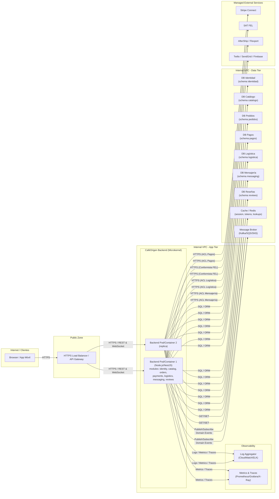

# 04 — Deployment / Infrastructure

Este diagrama representa la **topología de despliegue** de CaféOrigen para la fase actual del proyecto:

- Un backend monolítico modular (microkernel + plug‑ins) empaquetado en un **único contenedor**.
- Despliegue en una nube pública (por ejemplo, AWS) con **escalado horizontal**.
- Bases de datos lógicamente separadas por bounded context (pueden ser esquemas separados en el mismo clúster).
- Integraciones con servicios gestionados externos (Stripe, SAT FEL, transportistas, Twilio/SendGrid/Firebase).
- Componentes de observabilidad básicos (logs, métricas).

## Diagrama de despliegue

## Explicación de decisiones clave

1. **Un único backend (microkernel) con módulos plug‑in**  
   - Implementa la recomendación de `01-cafeorigen_arquitectura.md` y `03-service-module-decomposition.md`:  
     - Todos los bounded contexts (`identity`, `catalog`, `orders`, `payments`, `logistics`, `messaging`, `reviews`) viven en un solo proceso.  
     - Se aprovecha al máximo un **equipo pequeño (3–5 ingenieros)** y un presupuesto de infraestructura limitado (≈ $150–300/mes).

2. **Escalado horizontal en la capa de aplicación**  
   - Varios contenedores idénticos del backend detrás de un **load balancer**.  
   - El backend es **stateless**; el estado persistente vive en las bases de datos por contexto y en el broker de mensajes.

3. **Bases de datos por contexto (lógica o físicamente separadas)**  
   - Refuerza los **bounded contexts DDD**: cada módulo tiene su propio esquema / base.  
   - Evita un único “big ball of mud” en la base de datos y facilita futuras extracciones a microservicios.

4. **Message Broker para eventos de dominio internos**  
   - Soporta el modelo descrito en los flujos de datos: `PedidoRealizado`, `PagoAutorizado`, `PedidoCancelado`, etc.  
   - Permite que los módulos se comuniquen principalmente por **eventos**, manteniendo un acoplamiento bajo.

5. **Servicios gestionados externos**  
   - **Stripe**, **SAT FEL**, transportistas y proveedores de mensajería se consumen a través de ACLs dentro de los módulos de Pagos, Logística y Mensajería.  
   - Minimiza el esfuerzo operativo y mantiene el foco en el **core domain** de CaféOrigen.

6. **Observabilidad mínima pero suficiente**  
   - **Logs centralizados** y **métricas / trazas** permiten diagnosticar problemas de plug‑ins defectuosos, mitigando uno de los riesgos clave del microkernel (un fallo en un módulo puede afectar a todo el proceso).

En conjunto, esta topología mantiene la **simplicidad operativa** que exige el presupuesto del proyecto, pero deja claro cómo los bounded contexts se materializan en componentes físicos y cómo se podría evolucionar hacia una arquitectura más distribuida en el futuro.