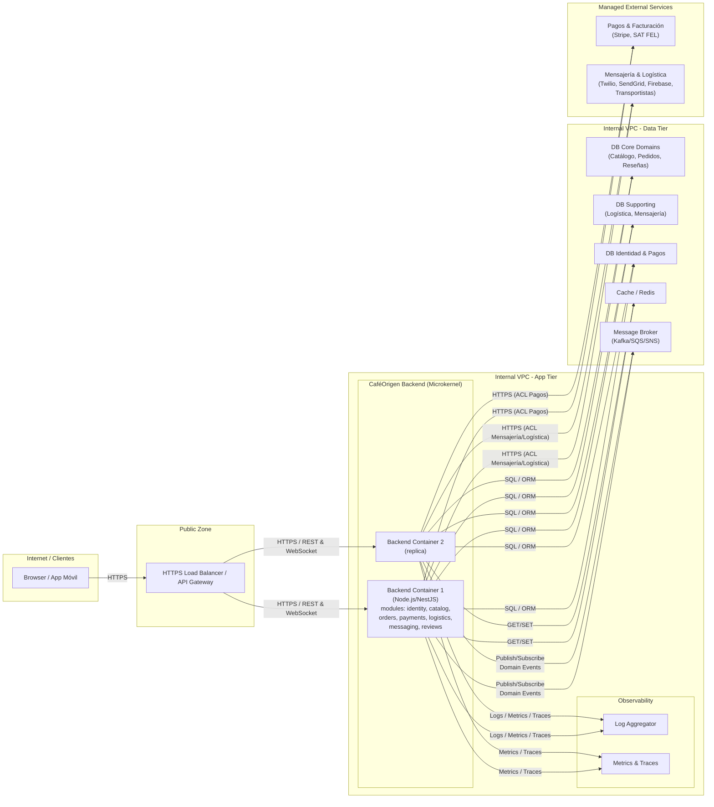

# 04 — Deployment / Infrastructure

Este diagrama representa la **topología de despliegue** de CaféOrigen para la fase actual del proyecto:

- Un backend monolítico modular (microkernel + plug‑ins) empaquetado en un **único contenedor**.
- Despliegue en una nube pública (por ejemplo, AWS) con **escalado horizontal**.
- Bases de datos lógicamente separadas por bounded context (pueden ser esquemas separados en el mismo clúster).
- Integraciones con servicios gestionados externos (Stripe, SAT FEL, transportistas, Twilio/SendGrid/Firebase).
- Componentes de observabilidad básicos (logs, métricas).

## Diagrama de despliegue

## Explicación de decisiones clave

1. **Un único backend (microkernel) con módulos plug‑in**  
   - Implementa la recomendación de `01-cafeorigen_arquitectura.md` y `03-service-module-decomposition.md`:  
     - Todos los bounded contexts (`identity`, `catalog`, `orders`, `payments`, `logistics`, `messaging`, `reviews`) viven en un solo proceso.  
     - Se aprovecha al máximo un **equipo pequeño (3–5 ingenieros)** y un presupuesto de infraestructura limitado (≈ $150–300/mes).

2. **Escalado horizontal en la capa de aplicación**  
   - Varios contenedores idénticos del backend detrás de un **load balancer**.  
   - El backend es **stateless**; el estado persistente vive en las bases de datos y en el broker de mensajes.

3. **Bases de datos alineadas con bounded contexts (agrupadas lógicamente)**  
   - En la implementación real, cada bounded context puede tener su propio esquema/base (Identidad, Catálogo, Pedidos, Pagos, Logística, Mensajería, Reseñas).  
   - En el diagrama se agrupan en tres nodos lógicos para mantener la legibilidad:
     - `DB Core Domains` para los contextos del core (Catálogo, Pedidos, Reseñas).  
     - `DB Supporting` para los contextos de soporte (Logística, Mensajería).  
     - `DB Identidad & Pagos` para los contextos genéricos (Identidad, Pagos).  
   - Esta separación refuerza los **bounded contexts DDD**, evita un único “big ball of mud” de datos y facilita futuras extracciones a microservicios sin cambiar la topología conceptual.

4. **Message Broker para eventos de dominio internos**  
   - Soporta el modelo descrito en los flujos de datos: `PedidoRealizado`, `PagoAutorizado`, `PedidoCancelado`, etc.  
   - Permite que los módulos se comuniquen principalmente por **eventos**, manteniendo un acoplamiento bajo y alineado con el diseño de bounded contexts.

5. **Servicios gestionados externos (agrupados por tipo)**  
   - En la realidad se integran varios servicios: Stripe, SAT FEL, APIs de transportistas, Twilio, SendGrid, Firebase, etc.  
   - El diagrama los agrupa en dos nodos para simplificar:
     - `Pagos & Facturación` (Stripe, SAT FEL).  
     - `Mensajería & Logística` (Twilio, SendGrid, Firebase, transportistas).  
   - Todos estos servicios se consumen a través de **ACLs** dentro de los módulos de Pagos, Logística y Mensajería, minimizando el esfuerzo operativo y manteniendo el foco en el **core domain** de CaféOrigen.

6. **Observabilidad mínima pero suficiente**  
   - **Logs centralizados** y **métricas / trazas** permiten diagnosticar problemas de plug‑ins defectuosos, mitigando uno de los riesgos clave del microkernel (un fallo en un módulo puede afectar a todo el proceso).  
   - La separación explícita de un subcomponente de observabilidad en el diagrama enfatiza que la plataforma se diseña desde el inicio con capacidad de monitoreo.

En conjunto, esta topología mantiene la **simplicidad operativa** que exige el presupuesto del proyecto, pero deja claro cómo los bounded contexts se materializan en componentes físicos (backend, bases de datos agrupadas, broker, servicios gestionados) y cómo se podría evolucionar hacia una arquitectura más distribuida en el futuro sin cambiar las fronteras de dominio.