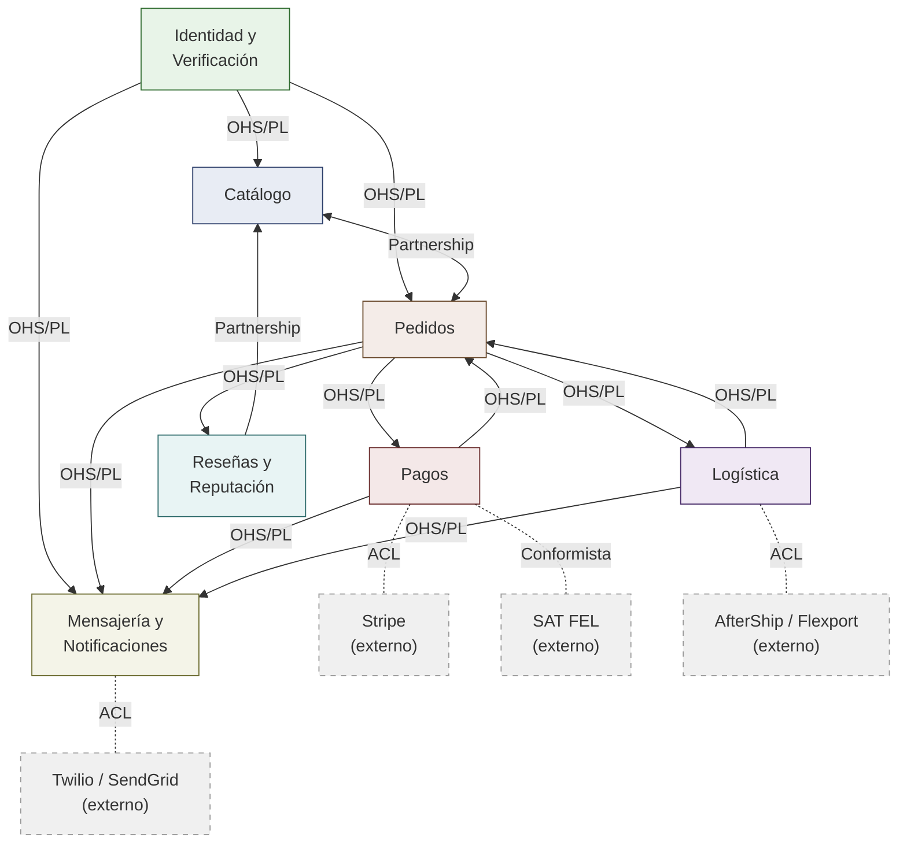

# 02 — Contextos Delimitados

## CaféOrigen: Descomposición del Dominio

### Descripción General

Este documento descompone el dominio de CaféOrigen en contextos delimitados utilizando Diseño Guiado por el Dominio (DDD). Cada contexto representa una capacidad de negocio distinta con límites de responsabilidad claros. Dado que elegimos una arquitectura microkernel, estos contextos se mapean al sistema central y sus módulos plug-in — pero los límites definidos aquí se mantendrían independientemente de la estrategia de despliegue.

---

### Contexto 1: Identidad y Verificación

| Campo | Descripción |
|-------|-------------|
| **Nombre** | Identidad |
| **Propósito** | Gestiona cuentas de usuario, autenticación, asignación de roles (productor, comprador, administrador) y el flujo de verificación de productores donde los administradores revisan licencias de exportación y certificaciones antes de que un productor pueda publicar lotes. |
| **Entidades Principales** | **Usuario** (id: UUID, email: string único, passwordHash: string, rol: enum [PRODUCTOR, COMPRADOR, ADMIN], estado: enum [ACTIVO, SUSPENDIDO], creadoEn: timestamp) · **PerfilProductor** (id: UUID, usuarioId: FK → Usuario, nombreFinca: string, región: string, altitud: int metros, tamañoFincaHectáreas: decimal, estadoVerificación: enum [PENDIENTE, APROBADO, RECHAZADO], verificadoEn: timestamp nullable) · **DocumentoVerificación** (id: UUID, productorId: FK → PerfilProductor, tipoDocumento: enum [LICENCIA_EXPORTACIÓN, CERT_ORGÁNICO, CERT_COMERCIO_JUSTO, NIT], archivoUrl: string, subidoEn: timestamp, revisadoPor: FK → Usuario nullable, notasRevisión: text nullable) |
| **Eventos Publicados** | `ProductorVerificado` · `ProductorRechazado` · `UsuarioRegistrado` · `UsuarioSuspendido` |
| **Eventos Consumidos** | Ninguno — este es un contexto upstream sin dependencias de dominio hacia otros contextos. |
| **Contextos Upstream** | Ninguno |
| **Contextos Downstream** | Catálogo (necesita estado de verificación del productor antes de permitir publicaciones) · Pedidos (necesita identidad de comprador/productor para crear pedidos) · Mensajería (necesita perfiles de usuario para conversaciones) |
| **Patrón de Integración** | **OHS/PL (Open Host Service / Published Language)** — Identidad expone una interfaz bien definida (validación de tokens, consulta de perfil de usuario, verificación de estado) que todos los contextos downstream consumen. El lenguaje publicado es un conjunto estable de DTOs (ResumenUsuario, EstadoProductor) que aíslan a los consumidores de cambios internos del esquema. |

---

### Contexto 2: Catálogo

| Campo | Descripción |
|-------|-------------|
| **Nombre** | Catálogo |
| **Propósito** | Gestiona el ciclo de vida de los lotes de café — creación, publicación, búsqueda y descubrimiento. Aquí es donde los productores describen su café (variedad, método de procesamiento, puntajes de catación) y donde los compradores navegan, filtran y comparan ofertas. |
| **Entidades Principales** | **LoteCafé** (id: UUID, productorId: FK → PerfilProductor, título: string, variedad: enum [BOURBON, CATURRA, TYPICA, GEISHA, CATUAÍ, OTRO], métodoProcesamiento: enum [LAVADO, NATURAL, HONEY, ANAERÓBICO], altitudMetros: int, fechaCosecha: date, cantidadDisponibleKg: decimal, precioPorKg: decimal USD, puntajeCatación: decimal 0–100 nullable, estado: enum [BORRADOR, PUBLICADO, AGOTADO, ARCHIVADO]) · **ImagenLote** (id: UUID, loteId: FK → LoteCafé, imagenUrl: string, ordenamiento: int, esPrincipal: boolean) · **NotaCatación** (id: UUID, loteId: FK → LoteCafé, autorId: FK → Usuario, aroma: int 1–10, acidez: int 1–10, cuerpo: int 1–10, sabor: int 1–10, posgusto: int 1–10, puntajeGeneral: decimal, notas: text, creadoEn: timestamp) |
| **Eventos Publicados** | `LotePublicado` · `LoteActualizado` · `LoteAgotado` · `LoteArchivado` · `NotaCataciónAgregada` |
| **Eventos Consumidos** | `ProductorVerificado` (de Identidad — habilita al productor para publicar lotes) · `PedidoConfirmado` (de Pedidos — decrementa cantidad disponible) · `PedidoCancelado` (de Pedidos — restaura cantidad disponible) |
| **Contextos Upstream** | Identidad (estado de verificación del productor) |
| **Contextos Downstream** | Pedidos (disponibilidad y precio del lote para validación de pedidos) · Mensajería (detalles del lote para contexto de conversación) |
| **Patrón de Integración** | **Partnership (Asociación)** con Pedidos — ambos contextos evolucionan juntos ya que la colocación de pedidos afecta directamente la disponibilidad del lote. Cambios en las reglas de precios o cantidades requieren coordinación entre ambos contextos. Catálogo también actúa como **OHS/PL** hacia Mensajería, exponiendo datos resumidos del lote a través de una interfaz estable. |

---

### Contexto 3: Pedidos

| Campo | Descripción |
|-------|-------------|
| **Nombre** | Pedidos |
| **Propósito** | Gestiona el ciclo de vida completo de la compra desde que el comprador se compromete con un lote hasta la confirmación de entrega. Administra la máquina de estados del pedido, validación de cantidades, coordinación de custodia (escrow) y el sub-flujo de solicitudes de muestras. |
| **Entidades Principales** | **Pedido** (id: UUID, compradorId: FK → Usuario, productorId: FK → Usuario, loteId: FK → LoteCafé, cantidadKg: decimal, precioPorKg: decimal, montoTotal: decimal, moneda: string default "USD", estado: enum [CREADO, PAGO_RETENIDO, CONFIRMADO, ENVIADO, ENTREGADO, COMPLETADO, CANCELADO, EN_DISPUTA], creadoEn: timestamp, actualizadoEn: timestamp) · **SolicitudMuestra** (id: UUID, compradorId: FK → Usuario, loteId: FK → LoteCafé, estado: enum [SOLICITADA, ENVIADA, RECIBIDA, FEEDBACK_DADO, EXPIRADA], direcciónEnvío: text, solicitadaEn: timestamp, notasFeedback: text nullable) · **HistorialEstadoPedido** (id: UUID, pedidoId: FK → Pedido, estadoAnterior: enum, estadoNuevo: enum, cambiadoPor: FK → Usuario, razón: text nullable, cambiadoEn: timestamp) |
| **Eventos Publicados** | `PedidoRealizado` · `PedidoConfirmado` · `PedidoCancelado` · `PedidoEnviado` · `PedidoEntregado` · `PedidoCompletado` · `PedidoEnDisputa` · `MuestraSolicitada` · `FeedbackMuestraDado` |
| **Eventos Consumidos** | `PagoAutorizado` (de Pagos — transiciona pedido a PAGO_RETENIDO) · `PagoCapturado` (de Pagos — confirma liberación del escrow) · `PagoFallido` (de Pagos — dispara cancelación) · `EstadoEnvíoActualizado` (de Logística — transiciona pedido a ENVIADO/ENTREGADO) · `LoteAgotado` (de Catálogo — previene nuevos pedidos en lotes agotados) |
| **Contextos Upstream** | Catálogo (disponibilidad y validación de precio del lote) · Identidad (identidad de comprador y productor) |
| **Contextos Downstream** | Pagos (montos del pedido y disparadores de escrow) · Logística (creación de envíos) · Mensajería (notificaciones de eventos del pedido) · Catálogo (decrementos de cantidad) |
| **Patrón de Integración** | **Partnership (Asociación)** con Catálogo (coordinación bidireccional sobre cantidad y disponibilidad). **OHS/PL** hacia Pagos y Logística — Pedidos publica un conjunto bien definido de eventos del ciclo de vida que los contextos downstream consumen sin necesidad de conocer los detalles internos del pedido. |

---

### Contexto 4: Pagos

| Campo | Descripción |
|-------|-------------|
| **Nombre** | Pagos |
| **Propósito** | Maneja todas las operaciones financieras: retenciones de custodia (escrow) vía Stripe Connect, captura de fondos al confirmar envío, reembolsos por cancelación o disputa, e integración con el sistema de Factura Electrónica en Línea (FEL) de Guatemala para cumplimiento tributario. |
| **Entidades Principales** | **TransacciónPago** (id: UUID, pedidoId: FK → Pedido, stripePaymentIntentId: string, monto: decimal, moneda: string, estado: enum [PENDIENTE, AUTORIZADO, CAPTURADO, REEMBOLSADO, FALLIDO], autorizadoEn: timestamp nullable, capturadoEn: timestamp nullable, reembolsadoEn: timestamp nullable) · **RetenciónEscrow** (id: UUID, transacciónId: FK → TransacciónPago, montoRetenido: decimal, condiciónLiberación: enum [ENVÍO_CONFIRMADO, ENTREGA_CONFIRMADA], expiraEn: timestamp, liberadoEn: timestamp nullable) · **Factura** (id: UUID, pedidoId: FK → Pedido, tipoFactura: enum [PROFORMA, FEL, COMERCIAL], númeroFactura: string único, númeroAutorizaciónFEL: string nullable, emitidaEn: timestamp, montoTotal: decimal, montoImpuesto: decimal, pdfUrl: string nullable) |
| **Eventos Publicados** | `PagoAutorizado` · `PagoCapturado` · `PagoFallido` · `PagoReembolsado` · `FacturaEmitida` |
| **Eventos Consumidos** | `PedidoRealizado` (de Pedidos — inicia autorización de escrow) · `PedidoEnviado` (de Pedidos — dispara captura del escrow) · `PedidoCancelado` (de Pedidos — dispara reembolso) · `PedidoEnDisputa` (de Pedidos — congela escrow pendiente de resolución) |
| **Contextos Upstream** | Pedidos (eventos del pedido que impulsan las transiciones de estado del pago) |
| **Contextos Downstream** | Pedidos (el estado del pago retroalimenta la máquina de estados del pedido) |
| **Patrón de Integración** | **ACL (Anti-Corruption Layer / Capa Anticorrupción)** hacia Stripe y la API FEL de la SAT — ambos son sistemas externos con sus propios modelos de datos y convenciones de nombres. El contexto de Pagos traduce entre el lenguaje de dominio de CaféOrigen (RetenciónEscrow, TransacciónPago) y el lenguaje de Stripe (PaymentIntent, Transfer) a través de una capa adaptadora explícita. Esto previene que el modelo de Stripe contamine el resto del dominio. **Conformist (Conformista)** hacia la especificación FEL de la SAT — debemos conformarnos exactamente al esquema de factura del gobierno; no hay espacio para negociar el contrato. |

---

### Contexto 5: Logística

| Campo | Descripción |
|-------|-------------|
| **Nombre** | Logística |
| **Propósito** | Rastrea el movimiento físico del café desde el productor hasta el comprador. Gestiona registros de envío, se integra con APIs de transportistas (AfterShip, Flexport, o seguimiento manual para mensajeros locales), y envía actualizaciones de estado que impulsan las transiciones del pedido. |
| **Entidades Principales** | **Envío** (id: UUID, pedidoId: FK → Pedido, transportistaId: string, númeroRastreo: string nullable, estado: enum [PENDIENTE, RECOGIDO, EN_TRÁNSITO, ADUANA, ENTREGADO, EXCEPCIÓN], fechaEntregaEstimada: date nullable, fechaEntregaReal: date nullable, direcciónOrigen: text, direcciónDestino: text, creadoEn: timestamp) · **EventoEnvío** (id: UUID, envíoId: FK → Envío, tipoEvento: string, ubicación: string nullable, descripción: text, ocurridoEn: timestamp, payloadCrudo: jsonb) · **Transportista** (id: UUID, nombre: string, proveedorAPI: enum [AFTERSHIP, FLEXPORT, MANUAL], estáActivo: boolean, regionesSoportadas: text[]) |
| **Eventos Publicados** | `EnvíoCreado` · `EstadoEnvíoActualizado` · `EnvíoEntregado` · `ExcepciónEnvío` |
| **Eventos Consumidos** | `PedidoConfirmado` (de Pedidos — crea un registro de envío pendiente) · `PedidoCancelado` (de Pedidos — cancela envío pendiente) |
| **Contextos Upstream** | Pedidos (la confirmación del pedido dispara la creación del envío) |
| **Contextos Downstream** | Pedidos (actualizaciones de estado del envío impulsan transiciones del pedido) · Mensajería (actualizaciones de envío disparan notificaciones a comprador/productor) |
| **Patrón de Integración** | **ACL (Capa Anticorrupción)** hacia APIs externas de transportistas — AfterShip, Flexport y el seguimiento manual cada uno tiene diferentes modelos de datos, formatos de webhook y taxonomías de estado. El contexto de Logística normaliza todos estos en su propio modelo de `EventoEnvío`. Una nueva integración de transportista significa un nuevo adaptador detrás de la ACL, no cambios al modelo de dominio. |

---

### Contexto 6: Mensajería y Notificaciones

| Campo | Descripción |
|-------|-------------|
| **Nombre** | Mensajería |
| **Propósito** | Maneja toda la comunicación entre usuarios — chat en tiempo real comprador-productor para negociación, y notificaciones del sistema a través de múltiples canales (email, WhatsApp, SMS, push). Actúa como el hub de notificaciones que reacciona a eventos de todos los demás contextos. |
| **Entidades Principales** | **Conversación** (id: UUID, loteId: FK → LoteCafé nullable, participantes: UUID[], tipo: enum [NEGOCIACIÓN, SOPORTE, SISTEMA], estado: enum [ABIERTA, CERRADA], creadaEn: timestamp, últimoMensajeEn: timestamp) · **Mensaje** (id: UUID, conversaciónId: FK → Conversación, remitenteId: FK → Usuario, contenido: text, tipoMensaje: enum [TEXTO, IMAGEN, ALERTA_SISTEMA], leídoPor: UUID[], enviadoEn: timestamp) · **RegistroNotificación** (id: UUID, destinatarioId: FK → Usuario, canal: enum [EMAIL, WHATSAPP, SMS, PUSH], claveTemplate: string, payload: jsonb, estado: enum [EN_COLA, ENVIADO, ENTREGADO, FALLIDO], enviadoEn: timestamp nullable, razónFallo: text nullable) |
| **Eventos Publicados** | `MensajeEnviado` · `NotificaciónEntregada` · `NotificaciónFallida` |
| **Eventos Consumidos** | `PedidoRealizado` (de Pedidos — envía confirmación a comprador y productor) · `PedidoConfirmado` (de Pedidos — notifica a ambas partes) · `PedidoEnviado` (de Pedidos — notifica al comprador con info de rastreo) · `PedidoEntregado` (de Pedidos — solicita al comprador calificar el lote) · `PagoCapturado` (de Pagos — notifica al productor que los fondos fueron liberados) · `EstadoEnvíoActualizado` (de Logística — envía actualizaciones de rastreo) · `ExcepciónEnvío` (de Logística — alerta a ambas partes sobre problemas de entrega) · `ProductorVerificado` (de Identidad — da la bienvenida al productor y solicita su primera publicación) · `MuestraSolicitada` (de Pedidos — notifica al productor de solicitud de muestra) |
| **Contextos Upstream** | Identidad (preferencias de contacto y configuración de canales del usuario) · Pedidos, Pagos, Logística, Catálogo (todos publican eventos a los que Mensajería reacciona) |
| **Contextos Downstream** | Ninguno — Mensajería es un contexto downstream terminal. Consume eventos y entrega notificaciones pero ningún otro contexto depende de él para lógica de dominio. |
| **Patrón de Integración** | **ACL (Capa Anticorrupción)** hacia proveedores externos de entrega — Twilio (WhatsApp y SMS), SendGrid (email) y Firebase (notificaciones push) cada uno tiene sus propios contratos de API. El contexto de Mensajería abstrae estos detrás de una interfaz `CanalNotificación` para que cambiar proveedores o agregar nuevos canales (ej. Line para mercados asiáticos) requiera solo un nuevo adaptador. **SK (Separate Kernel / Kernel Separado)** en relación con todos los contextos upstream — Mensajería se suscribe a eventos de todos los demás contextos pero no mantiene un modelo compartido con ninguno de ellos. Traduce los eventos entrantes a sus propios payloads de notificación de forma independiente. |

---

### Contexto 7: Reseñas y Reputación

| Campo | Descripción |
|-------|-------------|
| **Nombre** | Reseñas |
| **Propósito** | Gestiona las calificaciones de compradores y retroalimentación de catación después de la entrega, y calcula los puntajes de reputación de productores que alimentan el ranking de búsqueda del catálogo. Mantiene la integridad de las reseñas separada tanto del ciclo de vida del pedido como de los datos de publicación del catálogo. |
| **Entidades Principales** | **Reseña** (id: UUID, pedidoId: FK → Pedido único, reseñadorId: FK → Usuario, productorId: FK → Usuario, loteId: FK → LoteCafé, calificaciónGeneral: int 1–5, precisiónCalidad: int 1–5, comunicación: int 1–5, envío: int 1–5, comentario: text nullable, creadaEn: timestamp, esCompraVerificada: boolean default true) · **ReputaciónProductor** (id: UUID, productorId: FK → Usuario único, calificaciónPromedio: decimal, totalReseñas: int, puntajeCalidad: decimal, puntajeConfiabilidad: decimal, últimaActualizaciónEn: timestamp) · **RespuestaReseña** (id: UUID, reseñaId: FK → Reseña, respondedorId: FK → Usuario, contenido: text, creadaEn: timestamp) |
| **Eventos Publicados** | `ReseñaEnviada` · `ReputaciónActualizada` |
| **Eventos Consumidos** | `PedidoCompletado` (de Pedidos — abre la ventana de reseña para el comprador) · `PedidoEntregado` (de Pedidos — dispara un recordatorio de notificación vía Mensajería para dejar una reseña) |
| **Contextos Upstream** | Pedidos (el pedido completado valida que el reseñador es un comprador genuino) · Identidad (identidad del reseñador y productor) |
| **Contextos Downstream** | Catálogo (los puntajes de reputación influyen en el ranking de búsqueda y la visualización del lote) |
| **Patrón de Integración** | **Partnership (Asociación)** con Catálogo — los puntajes de reputación se comparten con Catálogo para influir en el ranking de búsqueda, requiriendo coordinación cuando los algoritmos de puntuación cambian. **Conformist (Conformista)** hacia Pedidos — Reseñas acepta el evento de pedido completado tal cual y no intenta influir en el modelo de pedido. |

---

### Mapa de Contextos

El siguiente diagrama muestra los siete contextos delimitados y sus relaciones, etiquetados con el patrón de integración que gobierna cada dependencia.

### Lectura del Mapa

**Relaciones internas:**

- **Identidad → Catálogo, Pedidos, Mensajería (OHS/PL):** Identidad es el contexto más upstream. Expone un lenguaje publicado (ResumenUsuario, EstadoProductor) que todos los contextos downstream consumen a través de una interfaz estable. Identidad nunca cambia sus DTOs públicos sin versionamiento.
- **Catálogo ↔ Pedidos (Partnership):** Estos dos contextos co-evolucionan. La colocación de pedidos decrementa la cantidad del lote; el archivado del lote previene nuevos pedidos. Cambios en el modelo de cualquiera de los dos contextos requieren coordinación bilateral.
- **Pedidos → Pagos, Logística, Mensajería (OHS/PL):** Pedidos es el emisor central de eventos. Publica un conjunto bien definido de eventos del ciclo de vida del pedido que los contextos downstream consumen. Cada contexto downstream interpreta estos eventos de forma independiente.
- **Pagos → Pedidos (OHS/PL):** El estado del pago fluye de regreso a Pedidos (autorización, captura, fallo), pero a través del mismo patrón basado en eventos — Pagos publica, Pedidos consume. No existe dependencia circular; ambos contextos publican y consumen del otro a través de eventos, no llamadas directas.
- **Reseñas → Catálogo (Partnership):** Los puntajes de reputación alimentan el ranking de búsqueda. Cuando el algoritmo de puntuación cambia, ambos contextos coordinan para asegurar consistencia.

**Integraciones con sistemas externos:**

- **Pagos → Stripe (ACL):** Una capa anticorrupción traduce entre el modelo de pagos de CaféOrigen y el modelo PaymentIntent/Transfer de Stripe, previniendo que el vocabulario de Stripe contamine el dominio.
- **Pagos → SAT FEL (Conformista):** CaféOrigen se conforma exactamente al esquema de factura de la autoridad tributaria guatemalteca. No hay negociación — el gobierno define el contrato.
- **Logística → AfterShip/Flexport (ACL):** Cada API de transportista tiene un modelo de datos, formato de webhook y taxonomía de estados diferente. La ACL normaliza todos estos en un modelo unificado de `EventoEnvío`.
- **Mensajería → Twilio/SendGrid (ACL):** Los proveedores de entrega de notificaciones se abstraen detrás de una interfaz de canal, permitiendo cambios de proveedor o adición de nuevos canales sin tocar el modelo de dominio.
