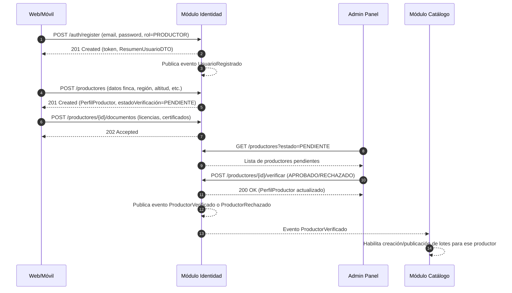
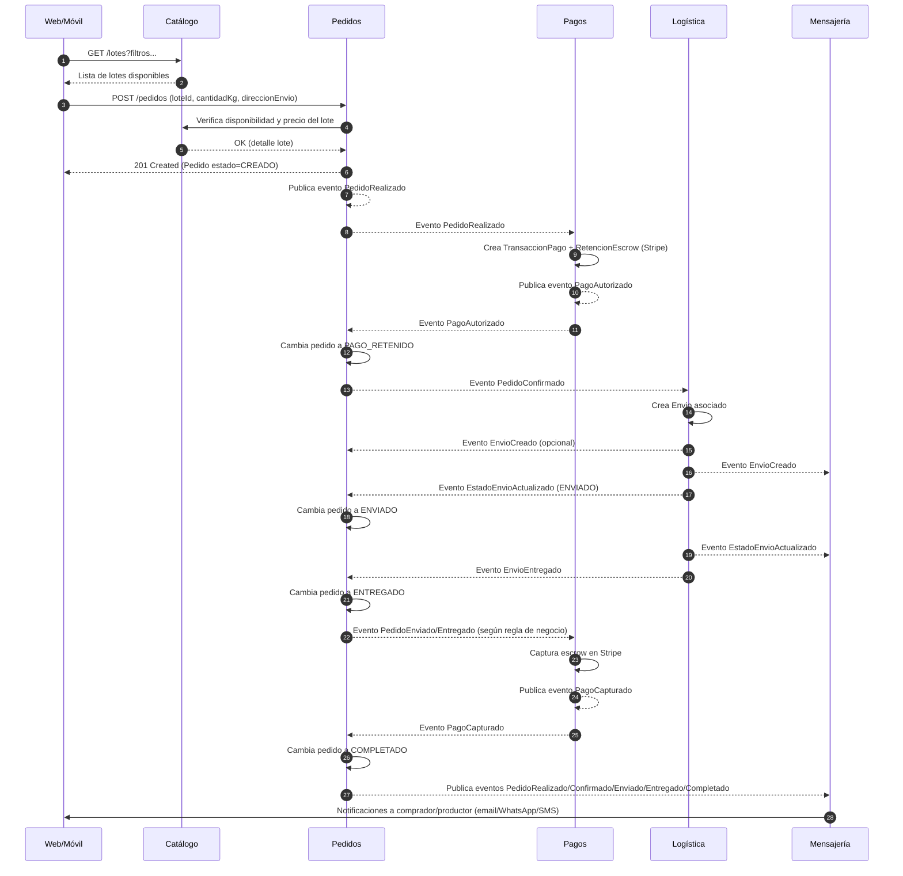
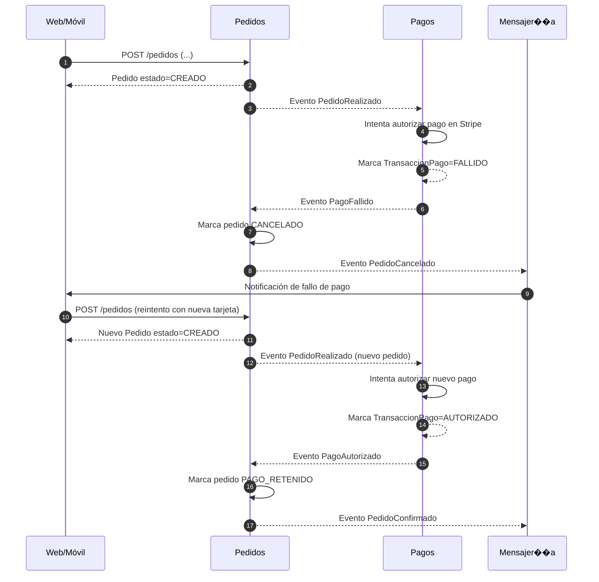
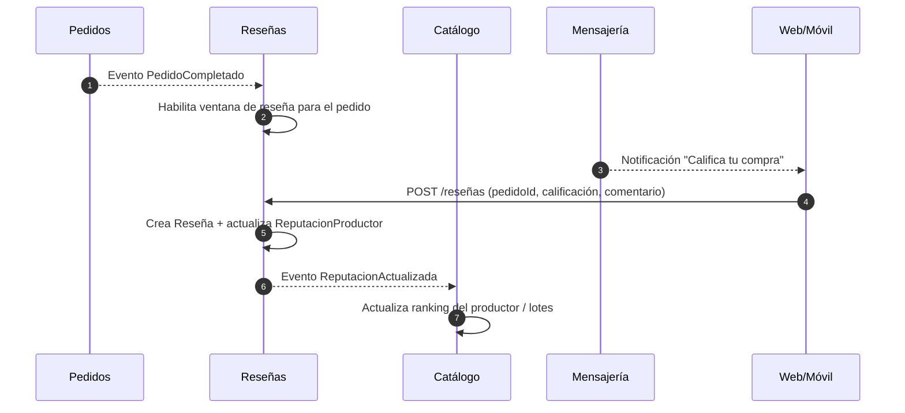

# 04 — Flujos de Datos e Interacciones

## 1. Flujo 1: Registro de usuario y verificación de productor

### 1.1 Descripción del escenario

Un nuevo productor se registra en CaféOrigen, crea su perfil de productor y envía documentos para verificación. Un administrador revisa los documentos y aprueba al productor, habilitándolo para publicar lotes en el catálogo.

### 1.2 Diagrama de secuencia (Mermaid)

### 1.3 Happy path

1. El usuario envía formulario de registro con rol PRODUCTOR.
2. **Identidad** crea `Usuario` y devuelve token de acceso.
3. El productor completa su `PerfilProductor` con datos de finca.
4. Sube los `DocumentoVerificacion` requeridos (licencia de exportación, NIT, etc.).
5. Un administrador revisa la cola de productores pendientes.
6. El administrador aprueba el productor.
7. **Identidad** cambia `estadoVerificación` a `APROBADO` y publica evento `ProductorVerificado`.
8. **Catálogo** recibe `ProductorVerificado` y permite a ese productor crear y publicar lotes.

### 1.4 Ruta de fallo / compensación

- **Caso 1: Documentos incompletos o inválidos**
  - El administrador marca el productor como `RECHAZADO`, agregando notas de revisión.
  - **Identidad** publica `ProductorRechazado`.
  - El frontend notifica al productor que debe volver a subir documentación válida.
  - El productor puede subir nuevos documentos; el perfil vuelve a `PENDIENTE`.

- **Caso 2: Intento de publicar lote sin verificación**
  - El productor intenta crear un lote en **Catálogo**.
  - Catálogo consulta el `EstadoProductorDTO` expuesto por Identidad (OHS/PL).
  - Si el estado es distinto de `APROBADO`, devuelve error de negocio “Productor no verificado” y no crea el lote.

---

## 2. Flujo 2: Pedido completo de un lote (orden de compra)

### 2.1 Descripción del escenario

Un comprador encuentra un lote en el catálogo, inicia un pedido, se retiene el pago en escrow, el productor envía el café, el envío se entrega y finalmente se completa el pedido.

### 2.2 Diagrama de secuencia (Mermaid)

### 2.3 Happy path

1. El comprador navega el catálogo y elige un `LoteCafe`.
2. Envía un POST `/pedidos` con `loteId` y `cantidadKg`.
3. **Pedidos** valida disponibilidad/precio consultando a **Catálogo** (Partnership).
4. Pedidos crea `Pedido` en estado `CREADO` y publica `PedidoRealizado`.
5. **Pagos** consume `PedidoRealizado`, crea `TransaccionPago` y `RetencionEscrow` vía Stripe:
   - Si Stripe autoriza el pago: publica `PagoAutorizado`.
6. **Pedidos** consume `PagoAutorizado` y cambia el estado del pedido a `PAGO_RETENIDO`.
7. Pedidos confirma el pedido (`PedidoConfirmado`) y lo envía a **Logística**.
8. **Logística** crea `Envio` y envía actualizaciones (`EstadoEnvioActualizado`) hasta `ENTREGADO`.
9. Al alcanzar el punto de negocio definido (ej. `PedidoEnviado` o `Entregado`), **Pagos** captura la retención escrow (`PagoCapturado`).
10. **Pedidos** marca el pedido como `COMPLETADO`.
11. **Mensajería** envía notificaciones a comprador y productor en cada evento clave.

### 2.4 Rutas de fallo / compensación

- **Caso 1: Falla de autorización de pago (Stripe)**
  1. Stripe rechaza el pago (fondos insuficientes, tarjeta inválida, etc.).
  2. **Pagos** marca la `TransaccionPago` como `FALLIDO` y publica `PagoFallido`.
  3. **Pedidos** consume `PagoFallido` y:
     - Marca el pedido como `CANCELADO`.
     - Publica `PedidoCancelado`.
  4. **Catálogo** consume `PedidoCancelado` y:
     - Restaura `cantidadDisponibleKg` del lote.
  5. **Mensajería** envía una notificación al comprador con el motivo del fallo y sugerencias (usar otra tarjeta, validar datos, etc.).

- **Caso 2: Productor no confirma / no envía el pedido**
  1. El pedido se mantiene mucho tiempo en estado `PAGO_RETENIDO` sin cambio a `CONFIRMADO/ENVIADO`.
  2. Una política de negocio (job programado) marca el pedido como `EN_DISPUTA`.
  3. **Pedidos** publica `PedidoEnDisputa`.
  4. **Pagos** al recibir `PedidoEnDisputa`:
     - Congela la `RetencionEscrow`.
     - Puede iniciar un flujo de resolución que termine en:
       - Reembolso (`PagoReembolsado`) y `PedidoCancelado`.
       - O confirmación manual y captura (`PagoCapturado`).
  5. **Mensajería** notifica a ambas partes y, potencialmente, a soporte interno.

---

## 3. Flujo 3: Pago fallido y reintento

### 3.1 Descripción del escenario

Durante el flujo de compra, el pago inicial falla (por ejemplo, banco rechaza la operación). El comprador actualiza su método de pago y se reintenta la autorización hasta completar el pedido.

### 3.2 Diagrama de secuencia (Mermaid)

### 3.3 Happy path

1. El primer intento de pago falla:
   - `TransaccionPago.estado = FALLIDO`.
   - `PagoFallido` → `PedidoCancelado` → notificación al usuario.
2. El comprador vuelve al carrito / detalle de lote.
3. Crea un nuevo pedido (o reintenta flujo específico de reintento de pago).
4. **Pagos** intenta de nuevo la autorización con la nueva tarjeta:
   - Si tiene éxito, se sigue el flujo normal de `PAGO_RETENIDO` → `CONFIRMADO` → etc.

### 3.4 Rutas de fallo / compensación

- **Caso 1: Varios fallos consecutivos**
  - Tras N intentos fallidos en una ventana de tiempo:
    - Se bloquea temporalmente el reintento para proteger contra fraude.
    - Se genera alerta interna (para equipo antifraude o soporte).

- **Caso 2: Error técnico en el proveedor de pagos (Stripe caído)**
  - **Pagos** distingue entre error de negocio (tarjeta rechazada) y error técnico:
    - En error técnico marca la `TransaccionPago` como `PENDIENTE` con `reintentoProgramado`.
    - Un job reintenta la autorización posteriormente.
    - **Mensajería** informa al usuario que su pago está en verificación y que recibirá actualización.

---

## 4. Flujo 4 (Extra): Pedido completado → Reseña y actualización de reputación

*(Este flujo conecta Pedidos, Reseñas y Catálogo, manteniendo la consistencia con el documento 02.)*

### 4.1 Descripción del escenario

Una vez recibido el café y completado el pedido, el comprador deja una reseña del productor y del lote. El sistema recalcula la reputación del productor y actualiza el ranking en el catálogo.

### 4.2 Diagrama de secuencia (Mermaid)

### 4.3 Happy path

1. **Pedidos** marca el pedido como `COMPLETADO` y publica `PedidoCompletado`.
2. **Reseñas**:
   - Abre la ventana de reseña para ese `pedidoId`.
   - Opcionalmente publica evento para Mensajería.
3. **Mensajería** envía notificación al comprador para calificar su compra.
4. El comprador envía la reseña.
5. Reseñas recalcula `ReputacionProductor` y publica `ReputacionActualizada`.
6. **Catálogo** consume `ReputacionActualizada` y ajusta el ranking de búsqueda.

### 4.4 Ruta de fallo / compensación

- **Caso: El comprador no envía reseña**
  - Después de cierto tiempo, la ventana expira (`esCompraVerificada` permanece, pero sin reseña).
  - Opcionalmente se envía un último recordatorio antes de expirar.
